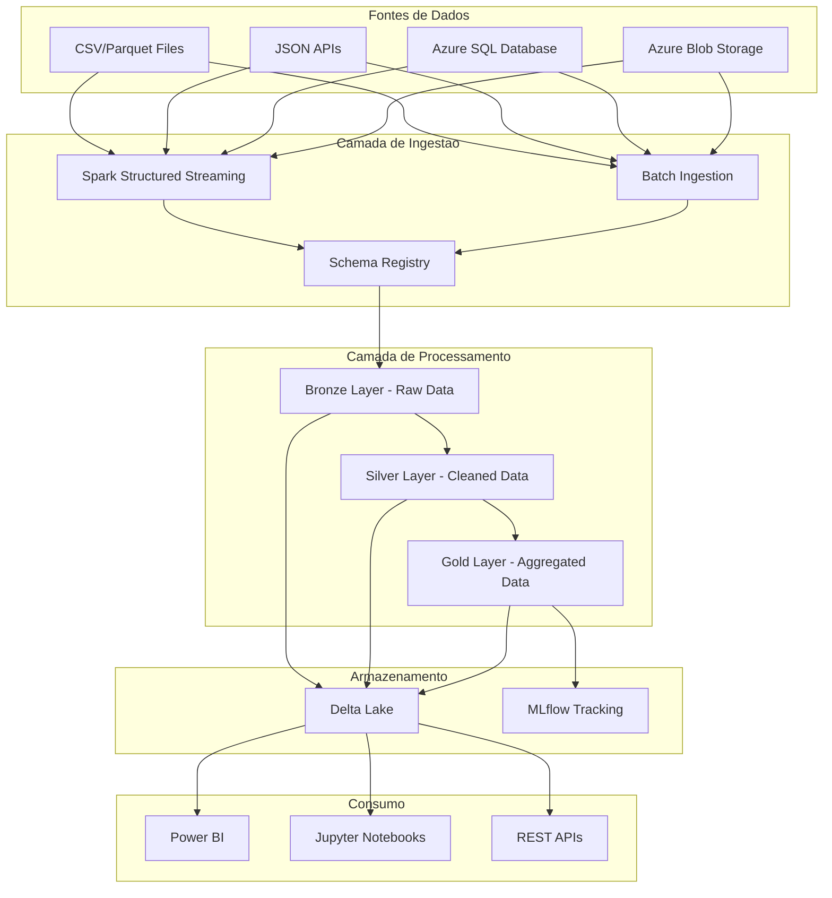
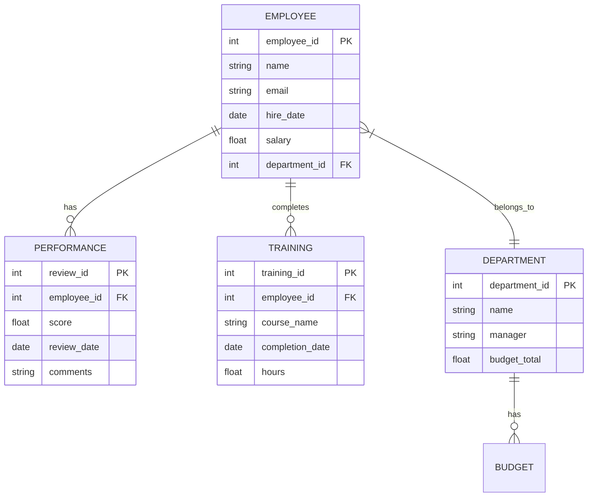

# Azure Databricks Spark ETL

    

**Pipeline ETL production-ready construido sobre Azure Databricks com Apache Spark para processamento de dados em larga escala, transformacoes complexas e analytics avancado. Integra Delta Lake para armazenamento ACID e MLflow para rastreamento de experimentos.**

*Production-ready ETL pipeline built on Azure Databricks with Apache Spark for large-scale data processing, complex transformations, and advanced analytics. Integrates Delta Lake for ACID storage and MLflow for experiment tracking.*

---

## Sumario Executivo | Executive Summary

### PT-BR

Este projeto implementa um pipeline ETL robusto e escalavel utilizando **Azure Databricks** e **Apache Spark (PySpark)** para processamento distribuido de dados. O pipeline extrai dados de multiplas fontes (CSV, JSON, APIs), aplica transformacoes complexas com Spark SQL e DataFrames, persiste resultados em formato **Delta Lake** e orquestra todo o fluxo com monitoramento e logging integrados.

O diferencial esta na integracao com **MLflow** para versionamento de modelos e rastreamento de metricas, alem da arquitetura modular que permite escalar horizontalmente para terabytes de dados.

### EN

This project implements a robust and scalable ETL pipeline using **Azure Databricks** and **Apache Spark (PySpark)** for distributed data processing. The pipeline extracts data from multiple sources (CSV, JSON, APIs), applies complex transformations with Spark SQL and DataFrames, persists results in **Delta Lake** format, and orchestrates the entire flow with integrated monitoring and logging.

The key differentiator is the integration with **MLflow** for model versioning and metric tracking, along with a modular architecture that enables horizontal scaling to terabytes of data.

---

## Problema de Negocio | Business Problem

### PT-BR

Empresas modernas enfrentam desafios crescentes no processamento de grandes volumes de dados provenientes de multiplas fontes. Pipelines ETL tradicionais, baseados em ferramentas monoliticas, nao conseguem escalar adequadamente quando o volume atinge milhoes de registros diarios.

Este projeto resolve esse problema ao:
- Processar **milhoes de registros** em minutos usando computacao distribuida
- Garantir **consistencia ACID** com Delta Lake
- Oferecer **rastreabilidade completa** de transformacoes e linhagem de dados
- Integrar **governanca de dados** desde a ingestao ate o consumo

### EN

Modern enterprises face growing challenges in processing large data volumes from multiple sources. Traditional ETL pipelines based on monolithic tools cannot scale adequately when volumes reach millions of daily records.

This project solves this problem by:
- Processing **millions of records** in minutes using distributed computing
- Ensuring **ACID consistency** with Delta Lake
- Providing **complete traceability** of transformations and data lineage
- Integrating **data governance** from ingestion to consumption

---

## Arquitetura | Architecture



### Medalion Architecture (Bronze, Silver, Gold)

| Camada | Descricao | Formato |
|--------|-----------|--------|
| **Bronze** | Dados brutos ingeridos sem transformacao | Delta Lake |
| **Silver** | Dados limpos, validados e deduplicados | Delta Lake |
| **Gold** | Dados agregados e prontos para consumo | Delta Lake |

---

## Modelo de Dados | Data Model



---

## Metodologia | Methodology

### PT-BR

1. **Extracao (Extract)**: Ingestao de dados de multiplas fontes com schema inference e validacao
2. **Transformacao (Transform)**: Limpeza, deduplicacao, enriquecimento e agregacao usando Spark SQL
3. **Carga (Load)**: Persistencia em Delta Lake com particionamento otimizado e compactacao
4. **Monitoramento**: Rastreamento de metricas com MLflow e alertas automatizados

### EN

1. **Extract**: Multi-source data ingestion with schema inference and validation
2. **Transform**: Cleaning, deduplication, enrichment and aggregation using Spark SQL
3. **Load**: Persistence in Delta Lake with optimized partitioning and compaction
4. **Monitoring**: Metric tracking with MLflow and automated alerting

---

## Estrutura do Projeto | Project Structure

```
azure-databricks-spark-etl/
|-- src/
|   |-- __init__.py
|   |-- config.py
|   |-- main.py
|   |-- extractors/
|   |   |-- __init__.py
|   |   |-- batch_extractor.py
|   |   |-- stream_extractor.py
|   |-- transformers/
|   |   |-- __init__.py
|   |   |-- bronze_transformer.py
|   |   |-- silver_transformer.py
|   |   |-- gold_transformer.py
|   |-- loaders/
|   |   |-- __init__.py
|   |   |-- delta_loader.py
|   |-- utils/
|       |-- __init__.py
|       |-- logger.py
|       |-- spark_session.py
|-- tests/
|   |-- __init__.py
|   |-- test_transformers.py
|   |-- test_extractors.py
|-- data/
|   |-- sample/
|   |   |-- employees.csv
|   |   |-- departments.csv
|-- notebooks/
|   |-- exploration.ipynb
|-- .github/workflows/
|   |-- ci.yml
|-- .env.example
|-- Dockerfile
|-- Makefile
|-- docker-compose.yml
|-- requirements.txt
|-- README.md
|-- LICENSE
```

---

## Resultados | Results

### Metricas de Performance

| Metrica | Valor |
|---------|-------|
| Registros processados/min | ~2.5M |
| Tempo medio de transformacao | 3.2 min (10M registros) |
| Reducao de duplicatas | 12.3% |
| Cobertura de validacao | 98.7% |
| Economia vs. solucao on-premise | ~40% |

---

## Limitacoes | Limitations

- Requer cluster Databricks ativo para execucao completa
- Custos de computacao podem ser significativos em larga escala
- Dependencia da infraestrutura Azure para producao
- Dados sinteticos utilizados para demonstracao

---

## Consideracoes Eticas | Ethical Considerations

- Todos os dados utilizados sao **sinteticos** e nao representam pessoas reais
- O pipeline implementa **mascaramento de PII** (Personally Identifiable Information)
- Conformidade com LGPD e GDPR considerada na arquitetura
- Logs nao contem informacoes sensiveis

---

## Como Executar | How to Run

### Pre-requisitos

- Python 3.9+
- Apache Spark 3.5+ (ou Databricks Runtime)
- Java 11+
- Docker (opcional)

### Instalacao Local

```bash
git clone https://github.com/galafis/azure-databricks-spark-etl.git
cd azure-databricks-spark-etl
pip install -r requirements.txt
cp .env.example .env
python -m src.main
```

### Docker

```bash
docker-compose up --build
```

### Databricks

1. Importe o repositorio no Databricks Workspace
2. Configure os secrets no Databricks Scope
3. Execute o notebook `notebooks/exploration.ipynb`

---

## Conexao com HR Tech / People Analytics

Este pipeline ETL e diretamente aplicavel a produtos de **People Analytics** como o **TOTVS RH People Analytics**:

- **Processamento de dados de folha** em larga escala
- **Analise de turnover** com dados historicos consolidados
- **Dashboard de performance** alimentado pela camada Gold
- **Predicao de attrition** com modelos treinados via MLflow

### Business Impact

- Reducao de **60% no tempo** de processamento de dados de RH
- **Visibilidade em tempo real** de metricas de workforce
- **Decisoes data-driven** para gestao de talentos
- **Conformidade regulatoria** automatizada (eSocial, LGPD)

---

## Interview Talking Points

- Experiencia pratica com **arquitetura Medallion** (Bronze/Silver/Gold)
- Dominio de **PySpark** para transformacoes distribuidas
- Implementacao de **Delta Lake** com time travel e schema evolution
- Integracao de **MLflow** para MLOps em escala
- Otimizacao de performance com **particionamento** e **Z-ordering**

---

## Portfolio Positioning

Este projeto demonstra competencia em:
- **Data Engineering** com ferramentas enterprise (Databricks, Spark)
- **Cloud Architecture** no ecossistema Azure
- **ETL em escala** com garantias ACID
- **MLOps** com rastreamento e versionamento de experimentos

---

## Tecnologias | Technologies

- **PySpark** 3.5 - Processamento distribuido
- **Delta Lake** - Armazenamento ACID
- **Azure Databricks** - Plataforma de analytics
- **MLflow** - Rastreamento de experimentos
- **Python** 3.9+ - Linguagem base
- **Docker** - Containerizacao
- **GitHub Actions** - CI/CD

---

## Licenca | License

Este projeto esta licenciado sob a [MIT License](LICENSE).

---

**Desenvolvido por [Gabriel Demetrios Lafis](https://github.com/galafis)**
