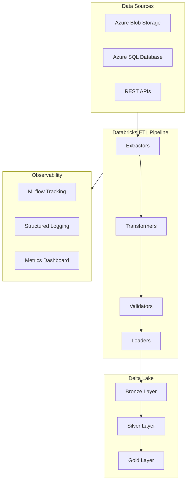
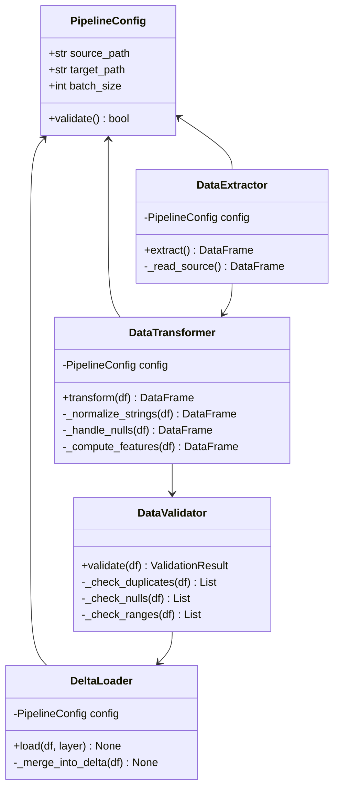

# Architecture Documentation

## System Architecture

## Data Flow

### Bronze Layer (Raw)
- Raw data ingested without transformation
- Schema-on-read with full audit trail
- Partitioned by ingestion date

### Silver Layer (Cleaned)
- Data type enforcement and null handling
- Deduplication and constraint validation
- Business key standardization

### Gold Layer (Business)
- Aggregated metrics and KPIs
- Denormalized for analytics consumption
- Optimized for query performance (Z-ORDER)

## Component Design

## Technology Stack

| Component | Technology | Purpose |
|---|---|---|
| Compute | Azure Databricks | Distributed processing |
| Processing | Apache Spark 3.5 / PySpark | Data transformations |
| Storage | Delta Lake | ACID transactions |
| Orchestration | Databricks Workflows | Job scheduling |
| Experiment Tracking | MLflow | Model and pipeline versioning |
| CI/CD | GitHub Actions | Automated testing and linting |
| Containerization | Docker | Reproducible environments |
| Language | Python 3.9+ | Core pipeline logic |

## Deployment Strategy

1. **Development**: Local Docker container with Spark standalone
2. **Staging**: Databricks workspace with test cluster
3. **Production**: Databricks with auto-scaling cluster, scheduled via Workflows

## Connection to HR Tech / People Analytics

This pipeline architecture directly supports HR Tech products such as **TOTVS RH People Analytics** by:

- Processing employee lifecycle data at scale (hiring, performance, turnover)
- Computing workforce KPIs (retention rate, salary equity, headcount forecasting)
- Enabling real-time dashboards for HR decision-makers
- Supporting compliance reporting (eSocial, RAIS) through standardized data models
- Providing the data foundation for predictive models (attrition risk, promotion readiness)
